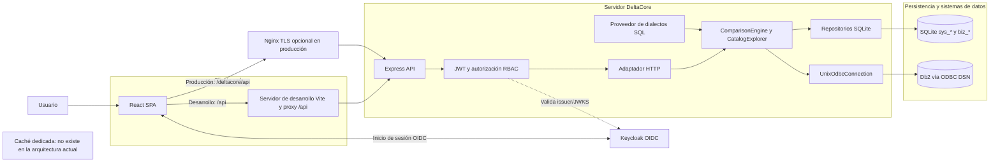
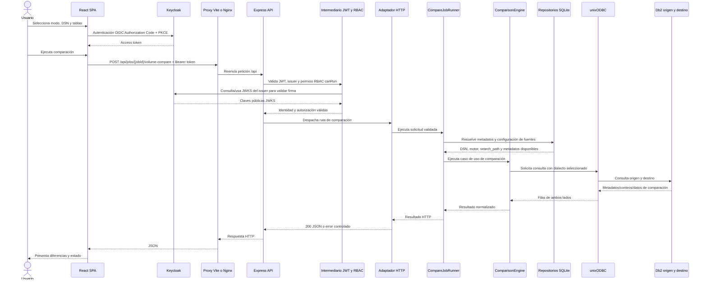
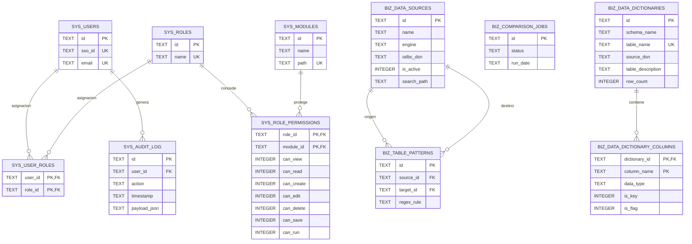
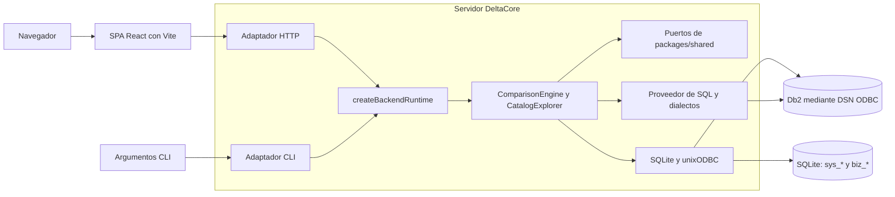
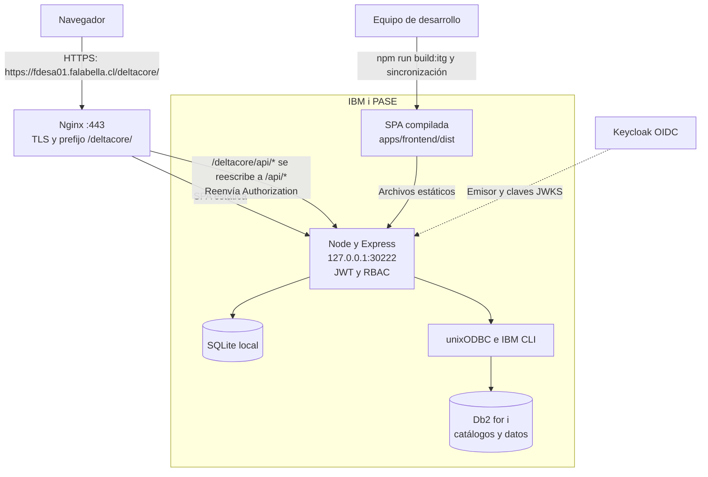

# DeltaCore: Arquitectura y guía de desarrollo

## 🚀 Guía de Inicio Rápido (Onboarding)

### Requisitos previos

| Requisito | Versión / detalle | Uso |
| --- | --- | --- |
| Node.js | `>=20` (definido en `package.json`) | Servidor, cliente web y herramientas de desarrollo |
| npm | `11.12.1` (`packageManager`) | Espacios de trabajo e instalación reproducible con `package-lock.json` |
| Docker y Docker Compose | Compose v2 recomendado; no se fija versión mínima en el repositorio | Keycloak y laboratorio Db2 opcionales |
| unixODBC | Instalación del sistema compatible con el driver IBM CLI | Conexiones ODBC desde macOS/Linux |
| IBM Data Server Driver / CLI | IBM CLI configurado en `infrastructure/odbc` o mediante `IBM_DB_HOME` | Conectar a Db2 por ODBC |
| Git | Versión disponible en el equipo | Control de versiones |

Python y Go no son requisitos del proyecto. Para ejecutar únicamente las pruebas del servidor, Docker y Db2 no son necesarios; Keycloak y una base Db2/DSN sí lo son para probar la autenticación y las consultas reales desde la aplicación.

### Instalar dependencias

Ejecutar en la raíz del repositorio. npm instalará los espacios de trabajo `apps/*` y `packages/*` desde un único archivo de bloqueo:

```bash
npm install
```

No hay comandos de instalación separados para el cliente web y el servidor. No se detecta un archivo `.npmrc` ni un gestor alternativo; utilizar npm para mantener la coherencia con `package-lock.json`.

### Variables de entorno

Crear el archivo local a partir de la plantilla y mantenerlo fuera del control de versiones:

```bash
cp .env.example .env
```

Las variables siguientes están definidas o documentadas por `.env.example`. Los valores indicados son los valores de laboratorio; reemplazar credenciales y hosts para otros entornos.

| Grupo | Variable | Propósito |
| --- | --- | --- |
| Vite | `VITE_DEV_HOST`, `VITE_DEV_PORT` | Equipo anfitrión y puerto del servidor de desarrollo (por defecto `127.0.0.1:5173`). |
| Vite | `VITE_HTTP_PREFIX` | Prefijo de despliegue bajo subruta, por ejemplo `/deltacore`; vacío en desarrollo local. |
| Vite | `VITE_API_PROXY_TARGET` | Destino del proxy `/api` (por defecto `http://127.0.0.1:4000`). |
| Vite / OIDC | `VITE_KEYCLOAK_URL`, `VITE_KEYCLOAK_REALM`, `VITE_KEYCLOAK_CLIENT_ID` | URL pública, dominio y cliente para iniciar sesión en la SPA. |
| Vite / laboratorio | `VITE_DB2_ODBC_DSN`, `VITE_SCHEMA_COMPARE_TABLES` | DSN presentado por la UI y tablas del botón de comparación del laboratorio. |
| Express | `BACKEND_HOST`, `PORT`, `CORS_ORIGIN` | Dirección/puerto de escucha y origen permitido; alinear CORS con la URL de navegador. |
| Express / UI | `SERVE_FRONTEND`, `FRONTEND_DIST_DIR` | Habilita servir el cliente web compilado; permite indicar su directorio de salida. |
| Seguridad | `KEYCLOAK_URL`, `KEYCLOAK_REALM`, `KEYCLOAK_ISSUER` | Emisor usado para validar JWT; `KEYCLOAK_ISSUER` es opcional y se deriva de la URL y el dominio. |
| Seguridad | `RBAC_ADMIN_EMAILS`, `JWT_CLOCK_TOLERANCE_SECONDS` | Correos con administración RBAC y tolerancia temporal JWT (segundos). |
| TLS opcional | `HTTPS_CERT_FILE`, `HTTPS_KEY_FILE` | Certificado y clave si Node termina TLS directamente; normalmente TLS termina en Nginx. |
| Keycloak Compose | `KEYCLOAK_BIND_ADDRESS`, `KEYCLOAK_HTTP_PORT`, `KEYCLOAK_ADMIN`, `KEYCLOAK_ADMIN_PASSWORD` | Publicación del puerto y cuenta admin del contenedor de desarrollo. No conservar las credenciales de ejemplo. |
| Db2 / ODBC | `DB2_BIND_ADDRESS`, `DB2_HOSTNAME`, `DB2_HOST_PORT`, `DB2_CONTAINER_PORT` | Dirección de enlace del contenedor y equipo anfitrión/puertos del servicio Db2. |
| Db2 / ODBC | `DB2_NAME`, `DB2_USER`, `DB2_PASSWORD`, `DB2_ODBC_DSN` | Base de datos, credenciales y nombre del DSN primario generado por `scripts/apply-odbc-from-env.sh`. |
| Catálogo | `DB2_SEARCH_PATH`, `DB2_CATALOG` | Ruta JSON de esquemas por defecto y dialecto (`luw` o `ibmi`). |
| Driver ODBC | `UNIXODBC_LIB_DIR`, `UNIXODBC_SYSCONF`, `IBM_DB_HOME`, `IBM_DB_LIB` | Ubicaciones opcionales del Driver Manager IBM CLI y sus bibliotecas. |

El archivo `.env` de la raíz es la fuente de configuración para los scripts, el servidor, Vite y Compose. No subir `.env` ni secretos. Las variables `VITE_*` se incorporan al paquete público del cliente web y nunca deben contener secretos. Cambiar `VITE_DEV_PORT` también requiere actualizar las URI de redirección y orígenes en `infrastructure/sso/deltacore-realm.json` y volver a importar el dominio de Keycloak. Para una instalación sin Db2 local, configurar un DSN existente accesible mediante unixODBC.

### Ejecutar localmente

Requisitos previos para el stack completo: Docker Desktop activo, `.env` configurado y unixODBC/IBM CLI funcionales. El comando `npm start` inicia infraestructura y aplicaciones; para desarrollo diario se pueden iniciar servicios por separado:

```bash
# Inicializar SQLite (esquema y datos iniciales)
npm run init:db

# Iniciar Keycloak y laboratorio Db2 en Docker
npm run start:infra

# Iniciar el servidor y Vite en paralelo
npm run dev
```

El servidor escucha por defecto en `http://127.0.0.1:4000`, la SPA en `http://127.0.0.1:5173` y Keycloak en `http://localhost:8080`. El proxy de Vite envía `/api` al servidor. Para iniciar todo con los scripts del proyecto:

```bash
npm start
```

Verificación y empaquetado:

```bash
npm test                         # Pruebas Vitest del servidor
npm run build                    # paquetes compartidos + servidor + cliente web
npm run cli -- list-schemas      # CLI de catálogo (DSN configurado)
npm run status
```

Vitest está configurado en `apps/backend/vitest.config.ts` e incluye `src/**/*.spec.ts`. El repositorio no declara un conjunto de pruebas para el cliente web. `npm run init:db` crea o inicializa SQLite en `apps/backend/data/deltacore.db`; el archivo de datos local no debe confundirse con una migración versionada.

## Pila Tecnológica

| Área | Tecnología | Responsabilidad |
| --- | --- | --- |
| Cliente web | React 19, TypeScript 5.9, Vite 7, React Router 7 | Aplicación de página única modular, navegación y empaquetado. |
| Estado / UI | TanStack Query 5, Axios, Tailwind CSS 4, DaisyUI 5, Lucide React, Recharts 3 | Acceso asíncrono a API, componentes y visualizaciones. |
| Servidor | Node.js, TypeScript 5.9, Express 5 | API HTTP, adaptador CLI y composición del entorno de ejecución. |
| Identidad | Keycloak 24.0.5, `keycloak-js` 26, `jose` 6 | Flujo OIDC Authorization Code + PKCE en el navegador; validación JWT/JWKS y RBAC en la API. |
| Persistencia local | SQLite | Fuentes de datos, diccionarios, trabajos y estado de seguridad/RBAC/auditoría. |
| Sistemas consultados | Db2 LUW/Db2 for i mediante ODBC | Catálogos, esquema, volumen y filas de los sistemas origen/destino. |
| Acceso a datos | `odbc` para Node, unixODBC, IBM Data Server Driver | Conexión nativa a DSN. |
| Contratos | Espacio de trabajo `@deltacore/shared` | Tipos y puertos compartidos entre cliente web y servidor. |
| Infraestructura | Docker Compose, Nginx (despliegue), PM2 (opcional) | Keycloak/Db2 de laboratorio, proxy TLS y proceso de producción. |
| Calidad | TypeScript estricto, Vitest 3 | Comprobación estática y pruebas unitarias del servidor. |

## Estándares de Código y Buenas Prácticas

- TypeScript está configurado en modo estricto (`strict`) en `tsconfig.base.json`; mantener los contratos compartidos en `packages/shared` y evitar dependencias de marcos de trabajo en ese paquete.
- No se detectan configuraciones de ESLint ni Prettier. No asumir que existe análisis estático de estilo o formato automatizado; respetar el estilo existente y validar mediante compilación y pruebas.
- Mantener delgados los adaptadores HTTP/CLI: la lógica de aplicación corresponde a `ComparisonEngine`, `CatalogExplorer` y los servicios de aplicación/dominio. Las implementaciones de ODBC, SQLite y los dialectos SQL permanecen en infraestructura.
- El SQL de los motores reside en `apps/backend/src/infrastructure/sql-dialects/<engine>/`; mantener separados Db2 LUW (`db2`) y Db2 for i (`db2-ibmi`). No incluir credenciales ni cadenas de conexión en errores o registros.
- Añadir pruebas Vitest junto al módulo, con nombres `*.spec.ts`; ejecutar primero la prueba específica y luego `npm test` o `npm run build` según el alcance.
- El repositorio no muestra una convención de ramas automatizada. Se recomienda el desarrollo basado en la rama principal (Trunk-Based Development): ramas breves `feat/<tema>` o `fix/<tema>`, solicitudes de incorporación pequeñas hacia la rama principal protegida, integración continua con `npm test` y `npm run build`, y versiones etiquetadas. Acordar con el equipo el nombre de la rama principal.

## Mapa del repositorio

```text
apps/
  backend/src/       # Código del servidor
    adapters/       # Entradas HTTP/Express y CLI; validación/autorización del límite
    application/    # Casos de uso: comparación, exploración de catálogo y jobs
    domain/         # Modelo y servicios/reglas de dominio
    composition/    # Construcción del entorno de ejecución y ensamblaje de dependencias
    infrastructure/ # ODBC, SQLite, SQL, dialectos y sistema de archivos
  frontend/src/      # Código del cliente web
    auth/           # Keycloak, cliente API, rutas protegidas y permisos
    components/     # Componentes compartidos y layout
    features/       # Vistas/casos de uso por catálogo, comparación, diccionario, etc.
    navigation/     # Estado de navegación y retorno entre vistas
packages/shared/   # Contratos TypeScript compartidos; sin dependencias de interfaz/HTTP
infrastructure/
  odbc/             # Configuración de unixODBC/IBM CLI
  sso/              # Compose y dominio de Keycloak
  db2-az7-generator/ # Imagen y datos de laboratorio Db2
scripts/            # Arranque, parada, compilación/despliegue, ODBC y tareas de datos
docs/               # Arquitectura y documentación técnica
```

No hay una capa MVC tradicional de controladores/servicios/ORM: los adaptadores, casos de uso, dominio e infraestructura son los límites principales. La persistencia SQLite y el acceso a Db2 están en infraestructura; el cliente web nunca accede directamente a las bases de datos.

## Arquitectura y flujos del sistema

## 📊 Diagramas de Arquitectura y Flujos (En formato Mermaid.js)

### Componentes y fronteras del sistema



Keycloak es un proveedor externo de identidad. Nginx solo forma parte del despliegue tras proxy TLS; en desarrollo Vite reenvía `/api` a Express. SQLite aloja metadatos y configuración local; los catálogos y datos comparados permanecen en los Db2 remotos. No se detectó Redis ni otra caché dedicada.

### Secuencia de una comparación HTTP



La ruta ilustrada es `POST /api/jobs/:jobId/volume-compare`; las variantes `schema-compare` y `row-compare` siguen la misma frontera HTTP. El servidor valida el token y los permisos en la API. El acceso a Db2 es de lectura para el análisis; los repositorios SQLite aportan metadatos y configuración local. En desarrollo, el proxy es Vite; en producción puede ser Nginx.

### Modelo de dominio y relaciones SQLite



El diagrama representa las relaciones definidas por claves foráneas en `init-schema.sql`. `BIZ_COMPARISON_JOBS` aparece como entidad independiente porque el esquema no declara relaciones FK para ella. Las entidades `BIZ_DATA_SOURCES` y `BIZ_DATA_DICTIONARIES` describen configuración y metadatos locales: las filas comparadas viven en las bases Db2 externas.

## Arquitectura hexagonal



Los adaptadores HTTP y CLI comparten el runtime y los casos de uso; la
autenticación JWT se aplica en el adaptador HTTP, no en el CLI.

### Topología de producción en IBM i

En IBM i, Vite no se ejecuta en PASE porque su dependencia `esbuild` no dispone
de un binario para `os400 ppc64`. El cliente web se compila en la máquina de
desarrollo con `npm run build:itg`, se sincroniza como `apps/frontend/dist` y lo
sirve el proceso compilado de Express.

La topología de producción sigue el patrón `coreweb`:



Nginx debe reenviar la cabecera `Authorization`. El cliente de Keycloak debe
permitir la URI pública de redirección:
`https://fdesa01.falabella.cl/deltacore/*`.

HTTP (`adapters/http`) y CLI (`adapters/cli`) son únicamente adaptadores y
comparten `createBackendRuntime()`.

- **`packages/shared`**: únicamente puertos y DTO (`IOdbcConnection`, `ISqlQueryProvider`, `IAuditRepository`, `IComparisonEngine`).
- **`apps/backend`**: aplicación/dominio y adaptadores (HTTP, CLI, SQLite, archivos SQL y unixODBC). La validación JWT se aplica solo a HTTP.
- **`apps/frontend`**: adaptadores React. La autenticación usa Keycloak; durante el desarrollo las llamadas a la API pasan por el proxy `/api` de Vite (`VITE_API_PROXY_TARGET`).
- **`apps/frontend`**: la autenticación usa el flujo de código de autorización (Authorization Code) + PKCE de Keycloak. `VITE_HTTP_PREFIX` define el subdirectorio de producción y antepone el prefijo a las llamadas a la API; en IBM i se utiliza `/deltacore/api` detrás de Nginx.
- **Infraestructura**: Compose de Keycloak, generador Db2 AZ7 y controlador unixODBC en `infrastructure/odbc`.

El SQL específico de cada motor no se escribe en TypeScript. Se carga desde
`apps/backend/src/infrastructure/sql-dialects/<engine>/<feature>.sql` y admite
interpolación mediante `{{var}}`.

Dialectos de catálogo Db2: `DB2_CATALOG=luw` selecciona `db2/` (SYSCAT,
Docker AZ7) y `DB2_CATALOG=ibmi` selecciona `db2-ibmi/` (QSYS2). El SQL de IBM i
no debe ubicarse en `db2/`, para no afectar el laboratorio LUW.

## Fuentes de datos para comparación

Las fuentes son **DSN ODBC**, no esquemas. El origen y el destino se eligen para
cada ejecución.

1. **SQLite `biz_data_sources`** (`SqliteDataSourceStore`): almacena `name`, `engine`, `odbc_dsn`, `search_path` (arreglo JSON, orden `*LIBL*` en IBM i) e `is_active`. `name` (Nombre asignado) es la clave lógica; guardar un nombre existente actualiza su DSN y metadatos. Un DSN puede tener varios nombres asignados. Datos iniciales: `sql-dialects/sqlite/seed-lab.sql` (`AZ7DB`, `AZ7DBPRDCL`).
2. **UI / HTTP**: `GET /api/data-sources` proporciona la lista a Comparar, Catálogo y Diccionario. En `/compare`, el usuario selecciona el DSN de origen y el de destino.
3. **CLI**: `--source` / `--target` (valor predeterminado: `DB2_ODBC_DSN` o `AZ7DB`; si no se indica destino, se usa el origen).
4. **unixODBC**: `scripts/apply-odbc-from-env.sh` escribe un único DSN (`DB2_ODBC_DSN`) a partir de `DB2_HOSTNAME`, `DB2_HOST_PORT`, `DB2_NAME`, `DB2_USER` y `DB2_PASSWORD`. Para DSN adicionales se requieren secciones `[nombre]` en `odbc.ini`.
5. **Cadena de conexión**: si `dsn === DB2_ODBC_DSN`, se usan los parámetros TCP/IP de `.env`; en caso contrario, `DSN=<dsn>;`.
6. **DSN desconocido** (sin fila SQLite): se utiliza el motor `db2` y la ruta de búsqueda de `DB2_SEARCH_PATH`.

La resolución de tablas sin esquema utiliza `search_path` mediante
`SchemaResolverService`. Las comparaciones de volumen y filas pueden anularlo
con `--source-schema` / `--target-schema`.

## Diccionario (SQLite)

Las tablas principales son `biz_data_dictionaries` y
`biz_data_dictionary_columns` (`is_key`, `is_flag`). Su implementación es
`SqliteDictionaryStore`.

- **Escritura desde la UI**: solo en `/dictionary` (`PUT /api/dictionary`).
- **Lectura**: `GET /api/dictionary?table&schema&dsn`; consulta SQLite primero y, si no hay datos, el catálogo activo mediante `describeTable`.
- **Definiciones FLAG**: los campos marcados como `is_flag` se interpretan por posición en el detalle de filas. `GET /api/dictionary/flags?table` obtiene descripciones y valores válidos de `AZBASWIT.AZUFD` en `db2-az7-p9-dev`.
- **Comparación de filas**: si la petición no incluye `--key`, se usan las columnas clave de SQLite; si no existen, la clave primaria del catálogo y, como último recurso, todas las columnas.

`biz_data_dictionaries` almacena `schema_name`, `table_name`,
`table_description`, `row_count`, `source_dsn` y la fecha de actualización.
`biz_data_dictionary_columns` almacena nombre, descripción, tipo, longitud,
escala, nulabilidad, metadatos de clave y marca FLAG. Las bases existentes
reciben las columnas faltantes mediante migraciones condicionales del store. La
API permite eliminar un diccionario por esquema/tabla o todos los asociados a
un DSN.

## Trabajos de comparación

`CompareJobRunner` ejecuta los siguientes modos mediante `ComparisonEngine`:

| Modo | Operación |
| --- | --- |
| schema-compare | Nombres y tipos de columnas (`schema-compare.sql`). |
| volume-compare | `COUNT(*)` y tamaño físico de tabla por cada lado; IBM i consulta `QSYS2.SYSTABLESTAT.DATA_SIZE`. |
| row-compare | Obtiene filas de ambos DSN y las compara en el proceso (`rowCompare.ts`). El límite predeterminado es 10 000 filas; devuelve los detalles categorizados dentro de ese límite. |

Rutas HTTP: `POST /api/jobs/:id/{schema,volume,row}-compare` (JWT).

### Flujo de comparación de esquemas en la UI

La vista React de esquemas envía una tabla por petición para que la barra de
progreso refleje las comparaciones en vivo ya completadas. `ComparisonEngine`
produce `schemaComparison` con una entrada por cada campo de la unión de origen
y destino, incluidos tipo, longitud, escala y estado (`Igual`, `Solo origen`,
`Solo destino`, `Tipo distinto`). La UI agrupa las entradas en una fila de
resumen por tabla y calcula la integridad como el porcentaje de campos marcados
`Igual`.

La descripción de tabla del resumen se obtiene, después del análisis, del
diccionario guardado para el DSN de origen. Si no está disponible, se consulta
el catálogo activo de origen. El análisis de esquemas no carga campos del
diccionario local. Al seleccionar **Ver**, se abre un modal que solicita
`catalog/describe` para ambos DSN; el modal prioriza las descripciones del
origen y usa las del destino como alternativa.

`StatusProvider` muestra notificaciones transitorias en la parte inferior de la
ventana. Es el canal para mensajes informativos, advertencias, errores de API y
diagnósticos SQL/ODBC completos. Las notificaciones se cierran manualmente o
después de tres segundos.

### Flujo de comparación de volumen y filas en la UI

`/compare` carga de SQLite los diccionarios locales del DSN de origen y los
presenta como tablas seleccionables. Muestra descripción, cantidad de columnas
y campos clave almacenados. Las tablas seleccionadas aparecen primero y se
deshabilita la ejecución si no hay ninguna seleccionada.

Los resultados de volumen se presentan en una tabla, con una fila por tabla
seleccionada: cantidades de registros de origen y destino, diferencia de
registros, tamaño físico de cada lado y diferencia de tamaño. Los resultados de
filas también se presentan en una tabla, con cantidades navegables por categoría
de diferencia. `RowDelta.details` conserva todos los registros modificados,
exclusivos de origen y exclusivos de destino dentro del límite; `samples` se
mantiene por compatibilidad.

Las páginas de detalle reciben una instantánea explícita
`SmartBackState.compare`. Al volver a `/compare`, restauran modo, DSN, límite,
tablas seleccionadas y filas de resultado. Al abrirse, actualizan el diccionario
de origen y los nombres de las fuentes para mostrar las descripciones locales y
las etiquetas DSN actuales. Las celdas modificadas muestran los valores de
origen y destino junto con un indicador de diferencia; la columna clave y la
cabecera permanecen fijas durante el desplazamiento. El detalle de filas
modificadas ofrece un filtro parcial, sin distinción entre mayúsculas y
minúsculas, para cada columna PrimaryKey; varios filtros se combinan con AND.
Las columnas FLAG se marcan en el diccionario, se interpretan por posición y se
complementan con descripciones y valores válidos de AZUFD. El modal FLAG puede
filtrar solo las diferencias y conserva las posiciones con valores aunque no
tengan definición. Los scripts SQL de homologación se generan únicamente para
las filas visibles; antes de copiar un script, el modal advierte sobre la
responsabilidad del operador y la certificación/prueba activa.

Rutas principales del cliente web: `/compare`, `/dictionary`, `/catalog` y `/jobs`.

## Conexiones parametrizadas

La única fuente de configuración es `.env` en la raíz del repositorio (véase
`.env.example`).

| Tramo | Variables de entorno |
| --- | --- |
| Navegador → SPA | `VITE_DEV_PORT`, `CORS_ORIGIN` |
| SPA → API (desarrollo) | `VITE_API_PROXY_TARGET`, `PORT` |
| SPA → Keycloak | `VITE_KEYCLOAK_URL`, `VITE_KEYCLOAK_REALM`, `VITE_KEYCLOAK_CLIENT_ID` |
| API → Keycloak | `KEYCLOAK_URL`, `KEYCLOAK_REALM`, `KEYCLOAK_ISSUER` opcional |
| Equipo anfitrión → contenedor Keycloak | `KEYCLOAK_HTTP_PORT` (se asigna al puerto 8080 del contenedor) |
| Equipo anfitrión / ODBC → Db2 | `DB2_HOSTNAME`, `DB2_HOST_PORT`, `DB2_NAME`, `DB2_USER`, `DB2_PASSWORD`, `DB2_ODBC_DSN` |
| Ruta alternativa `*LIBL*` del laboratorio | `DB2_SEARCH_PATH` |
| SQL de catálogo Db2 | `DB2_CATALOG` (`luw` o `ibmi`) |
| Publicación de Db2 en Docker | `DB2_HOST_PORT`:`DB2_CONTAINER_PORT` |
| Instalación unixODBC | `UNIXODBC_LIB_DIR`, `UNIXODBC_SYSCONF` opcional |
| IBM CLI | `IBM_DB_HOME`, `IBM_DB_LIB` |
| Despliegue público en IBM i | `VITE_HTTP_PREFIX`, `SERVE_FRONTEND`, `BACKEND_HOST`, `PORT`, `CORS_ORIGIN` |
| TLS directamente en Node (opcional) | `HTTPS_CERT_FILE`, `HTTPS_KEY_FILE` |
| Administración RBAC | `RBAC_ADMIN_EMAILS` |
| Tolerancia de desfase horario JWT | `JWT_CLOCK_TOLERANCE_SECONDS` |

Scripts:

- `scripts/start.sh`, `stop.sh` y `status.sh` cargan `.env` mediante `scripts/load-env.sh`.
- `scripts/apply-odbc-from-env.sh` actualiza los archivos del DSN principal antes del inicio.
- `envDir` de Vite apunta a la raíz para que la SPA pueda leer `VITE_*`.
- El backend inicia `tsx` con `--env-file=../../.env`.
- Compose de Keycloak recibe el archivo de entorno de la raíz.

El puerto HTTP de Keycloak dentro del contenedor permanece en `8080`; solo se
puede configurar el puerto del **equipo anfitrión**. Lo mismo aplica a Db2:
`DB2_CONTAINER_PORT` define el puerto del proceso dentro de la imagen
(normalmente `50000`).

## Notas de ejecución

- El destino de producción es IBM i PASE; el entorno de laboratorio utiliza Docker y unixODBC en macOS.
- Si se cambia el puerto de la SPA, también deben actualizarse las URI de redirección del cliente Keycloak para que funcione el inicio de sesión OIDC.
- `GET /health` no requiere autenticación y lo utiliza `npm run status`.
- El archivo SQLite es `apps/backend/data/deltacore.db` (excluido de Git). Para inicializar una base nueva, ejecutar `npm run init:db`.
- Durante la inicialización, SQLite espera hasta 10 segundos si la base está bloqueada, evitando fallar de inmediato cuando otro proceso la mantiene ocupada brevemente.

## Autenticación y RBAC

El navegador utiliza el cliente público de Keycloak configurado mediante
`VITE_KEYCLOAK_URL`, `VITE_KEYCLOAK_REALM` y `VITE_KEYCLOAK_CLIENT_ID`. El
servidor valida el token Bearer con las claves JWKS del emisor configurado por
`KEYCLOAK_URL` y `KEYCLOAK_REALM`; no se necesita un secreto de cliente para
validar los JWT entrantes.

En la primera petición autenticada válida, `SqliteRbacStore.ensureUser()` crea
el usuario en `sys_users` y le asigna el perfil predeterminado `admin`. Después,
un administrador puede asignarle exactamente un perfil desde **Usuarios**. El
perfil `solo lectura` permite consultar los módulos autorizados, pero no crear,
editar, eliminar ni guardar; se ocultan las opciones de menú sin `canView`. Un
valor temporal de `JWT_CLOCK_TOLERANCE_SECONDS` puede compensar el desfase del
reloj de IBM i, pero el reloj debe sincronizarse y la tolerancia debe volver a
su valor habitual.

### Matriz de permisos

`sys_role_permissions` almacena acciones independientes para cada módulo:
`canView` controla la navegación; `canRead`, las consultas; `canCreate`, la
creación de recursos; `canEdit`, su actualización; `canDelete`, su eliminación;
`canSave`, la persistencia de formularios o cambios en el diccionario; y
`canRun`, las comparaciones, los trabajos o la generación de SQL desde los
detalles. `ProfileView` expone las siete acciones y el adaptador HTTP las hace
cumplir en el servidor, sin depender solo de controles deshabilitados en el
cliente web.

El perfil `solo lectura` no tiene permisos de escritura, aunque puede recibir
`canRun` si esa acción se habilita expresamente. Los recursos compartidos
resuelven su módulo propietario entre `COMPARE`, `DICTIONARY` y `CATALOG`, para
mantener válidos los perfiles granulares en los flujos de diccionario y
catálogo.

Para homologar en IBM i, despliegue los artefactos compilados, ejecute de forma
remota `node apps/backend/dist/infrastructure/sqlite/init-cli.js` para preparar
el esquema y reinicie el servidor compilado. Al abrir la base, el servidor aplica
migraciones SQLite condicionales, como la incorporación de
`sys_role_permissions.can_run`. Verifique la ruta de salud, la SPA estática,
el servidor compilado y `PRAGMA table_info(sys_role_permissions)` con el cliente
remoto `sqlite3`. La comprobación debe conservar los datos `biz_*` existentes y
añadir las columnas RBAC y los perfiles integrados que falten.
